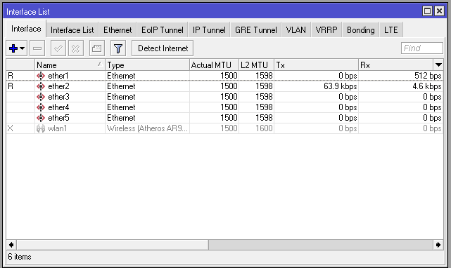
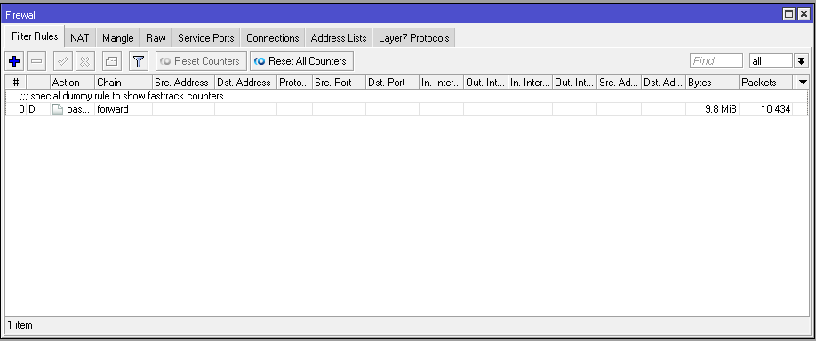

# MikroTik-Blank-Config

 MikroTik Blank Configuration memiliki IP Address 0.0.0.0. MikroTik Blank configuration merupakan MikroTik yang belum dikonfigurasi sama sekali, atau masih kosong konfigurasi nya.

 Saat pertama kali menggunakan MikroTik baru atau setelah MikroTik dilakukan reset configuration,  akses via winbox akan menampilkan keterangan konfigurasi default dari pabrik. Jika ingin mengosongkan konfigurasi (Blank Configuration), maka pilih opsi Remove Configuration

 

 Ketika MikroTik sudah di konfigurasi, dan kita mau menggunakan Blank Configuration, maka lakukan Reset Configuration, dengan menceklis No Default Configuration
 

Berikut ini beberapa parameter yang ada pada blank configuration:\
 ⦁	Dapat di remote menggunakan winbox dari port ethernet manapun, dan muncul IP Address 0.0.0.0

 

 ⦁	Interface wlan1 pada posisi disabled, nama interface belum diganti  

 ⦁	Firewall > Filter Rules = kosong tidak ada konfigurasi 

# Kesimpulan : 
 Blank Configuration pada MikroTik sangat cocok digunakan untuk pengguna yang ingin belajar konfigurasi MikroTik dari awal. Dengan Blank Configuration user dapat melakukan akses dari ether1.

Sekian yang dapat saya sampaikan, mohon maaf apabila ada salah kata atau kekurangan dalam penyampaian. Akhir kata, Wassalam
